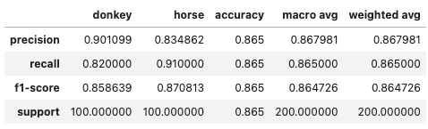
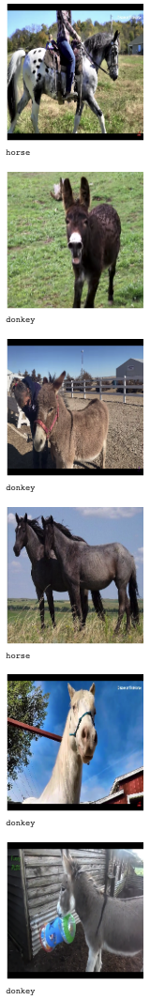

# Horse Donkey Classification

This is a horse-donkey image classifier using Keras CNN built from scratch. The test accuracy is currently 0.865.


## Tech Stack Highlights
* Web scraping using Selenium
* Image classification using Keras CNN
  * Data augmentation for small dataset
  * Train, validation and test dataset split
  * Save the best model
  * Visualization of training results
* Image preproccessing by dropping duplicates and visual filtering
* Using Google Colab (Jupyter) notebooks

## Motivation
Horses and donkeys look quite similar, yet for most of the time I can somehow distinguish them even I cannot clearly explain why. But, can a trained Keras CNN become a better classifier than me?

Apart from the above, lack of donkey image datasets on the internet is also one of the reasons I want to do this project, because that means I can even apply more tricks like web scraping and data augmentation.

## Data
The dataset consists of the following:
* Train (to train the model)
  * Horse: 800 images
  * Donkey: 800 images
* Validation (to evaulate the performance of model during training)
  * Horse: 100 images
  * Donkey: 100 images
* Test (to have final evaluation with images never seen during training)
  * Horse: 100 images
  * Donkey: 100 images
* Outputs (stored in outputs folder, generate predictions only)
  * Horse: 3 images
  * Donkey: 3 images

The sources of the dataset are as follows:
* Horse
  * https://www.kaggle.com/datasets/iamsouravbanerjee/animal-image-dataset-90-different-animals
  * https://www.kaggle.com/datasets/alessiocorrado99/animals10
* Donkey
  * Google Images scraping using ```image_scrape.py```
* Images for predicting (stored in outputs folder)
  * Captured from videos to avoid using the same images from Google Images

## Workflow
<br><br>

## Codes
```image_scrape.py```<br>
Scrape and download images from Google Images search.

```find_duplicate.py```<br>
Find and drop duplicated images. User can specify an ideal size and if duplicates are found, the one which is nearer to the ideal size will be kept.

```rename.py```<br>
Rename all the images in a folder for easier management. For example, if there are 2000 PNG images in folder about dogs, the file name can be set from ```dog_0001.png``` to ```dog_2000.png```.

```horse_donkey_classification.ipynb```<br>
Train, evaluate and save the Keras CNN image classification model. The model can also be used to predict new pictures.

## Results
The testing accuracy (predicting unseen images) is 0.865.
<br><br>

Here are the predictions done on new images.
<br><br>
We can see only the fifth picture, which should be a horse, is wrongly classified.

## Reflection and Next Steps
While the testing accuracy is quite satisfying, I noticed that the learning curve in terms of validation accuracy and validation loss during the training process was not that stable or smooth. That means the model performed extremely well on training set but not that well on pictures they never saw.  
<br><br>
This made me believe there should be still some room for improvement in the modelling. And I would try the following:
* Add more dataset
* Try more combinations of parameters
* Add more epochs if I see there will be potentials of improvement

## References
1. https://www.kaggle.com/general/284252
2. https://medium.com/@somilshah112/how-to-find-duplicate-or-similar-images-quickly-with-python-2d636af9452f
3. https://blog.keras.io/building-powerful-image-classification-models-using-very-little-data.html